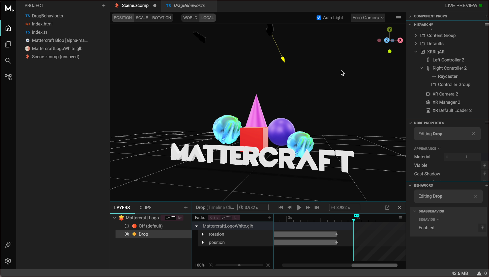
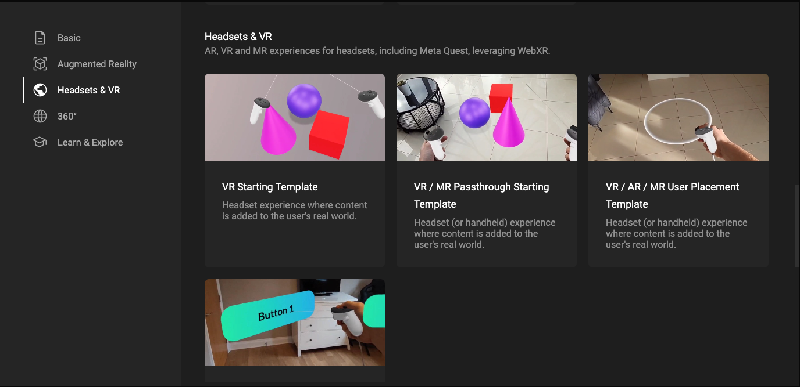

[Mattercraft](https://zap.works/mattercraft/) by Zapworks is a rich, browser-based, 3D visual editor setup for building AR, WebXR and 3D web content.

Development of WebXR is intuitive and fast in Mattercraft with a live realtime preview, visual viewport and graphical user interface, enabling iterative changes without having to reload or rebuild. Built with three.js at the core of the rendering engine, Mattercraft is highly performant and optimized for all devices. Other features include a full key-framing animation system, physics engine (Havok), and particle system.

- Use controller tracking, controller inputs and raycast events to build immersive XR content deployed directly to the web.
- Track hands, listen for gestures or use your hands as controllers to enable user input, perfect for headsets like the Apple Vision Pro.
- In full Virtual Reality experiences, use the locomotion systems to move around your 3D scene. Make use of teleport, walk or turn movement controls.

Mattercraft includes a number of template projects that are a great starting point for your next project.

Full documentation can be found [here](https://docs.zap.works/mattercraft/webxr/).
Video tutorial to help get started with WebXR in Mattercraft [here](https://www.youtube.com/watch?v=qDwpBpULg5c&t=123s).
