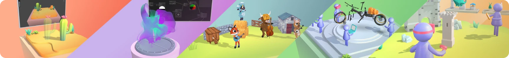

[Needle Engine](https://needle.tools/) is a web engine for complex and simple 3D applications alike. It is flexible, extensible and has built-in support for collaboration and XR! It is built around the **glTF standard** for 3D assets.   

Powerful integrations for **Unity** and **Blender** allow artists and developers to collaborate and manage web applications inside battle-tested 3d editors. Needle Engine integrations allow you to use editor features for exporting models, author materials, animate and sequence animations, bake lightmaps and more with ease.   

Our powerful and easy to use compression and optimization pipeline for the web make sure your files are ready, small and load fast!

Follow the [Getting Started Guide](https://docs.needle.tools/getting-started) to download and install Needle Engine. You can also find a [list of sample projects](https://engine.needle.tools/samples) that you can try live in the browser and download to give your project a headstart.   
For writing custom components read the [Scripting Guide](http://docs.needle.tools/scripting).