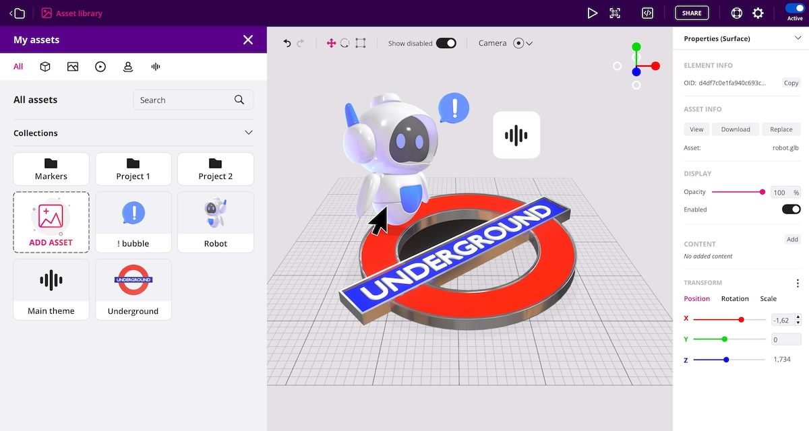

[Onirix Studio](https://studio.onirix.com/) is a web-based no-code editor for creating WebAR experiences.

It supports several types of AR scenes and tracking modes (Surface, Image, Space, etc) and fallbacks to a custom tracking implementation if WebXR is not available in target device or browser.

In order to help you getting started and get some inspiration, we recommend you to check our [Experience Library](https://www.onirix.com/experience-library/).
To start creating your own projects, you can just [register](https://studio.onirix.com/register) for free and follow the instructions of the editor which is extremely intuitive.
Whenever you need assistance you can refer to the [documentation](https://docs.onirix.com), which includes an in-depth description of all features and modules.
And lastly, if you want to extend custom behavior and go deeper you can check the [SDKs](https://docs.onirix.com/onirix-sdk).

