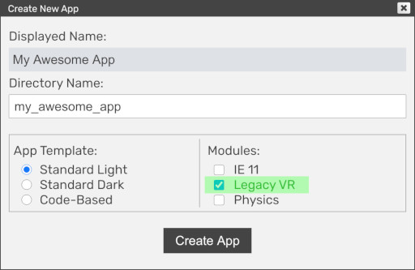
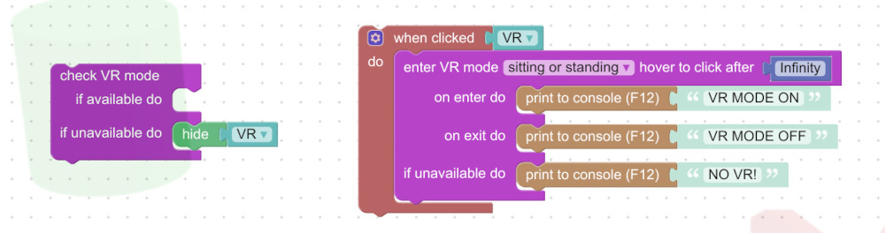
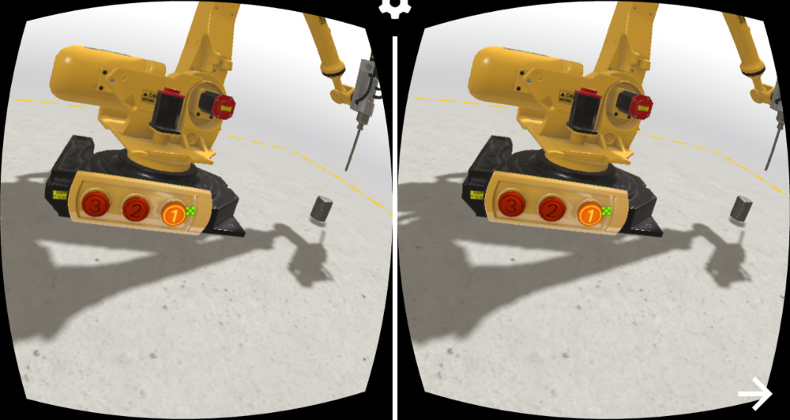
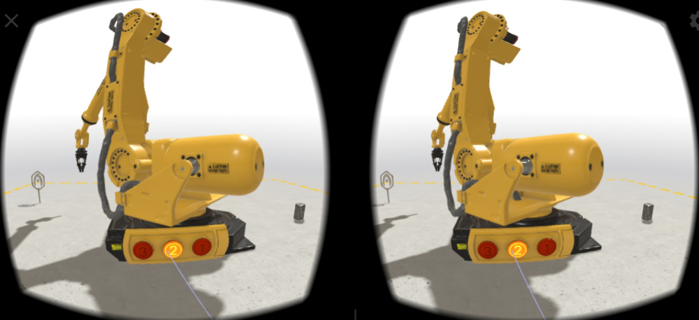
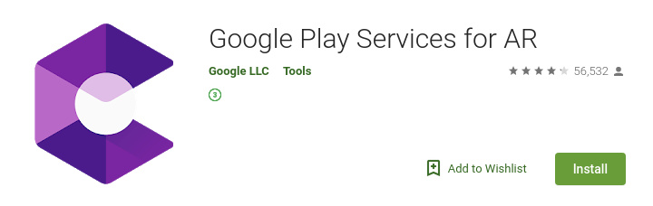
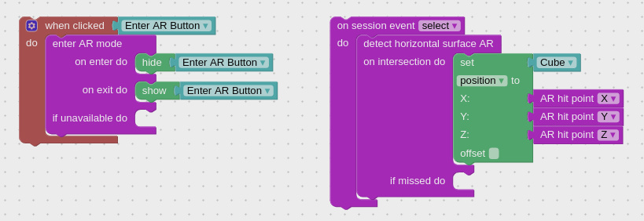
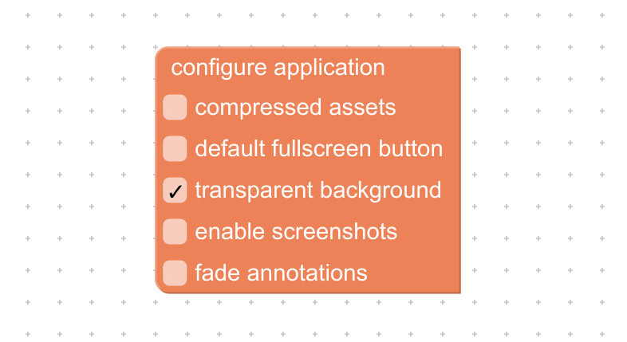

[Verge3D](https://www.soft8soft.com/verge3d) is an artist-friendly toolkit that allows Blender, 3ds Max, or Maya artists to create immersive web-based experiences. Verge3D can be used to build interactive animations, product configurators, engaging presentations of any kind, online stores, explainers, e-learning content, portfolios, and browser games.

## Setting up Virtual Reality

We recommend to enable the *Legacy VR* option in app creation settings in the App Manager in order to support a wider range of browsers (such as Mozilla Firefox) and devices.

Cardboard devices should work out of the box in any mobile browser, both on Android and iOS.

Google Daydream works in stable Chrome browser on Android phones while HTC and Oculus devices should work in both Chrome and Firefox browsers.

Plese note that WebXR requires a secure context. Verge3D apps must be served over HTTPS/SSL, or from the localhost URL.

The VR mode can be set up for any Verge3D app using [enter VR mode](https://www.soft8soft.com/docs/manual/en/puzzles/AR_VR.html#enter_vr_mode) puzzle.

Interaction with 3D objects is performed by using the gaze-based reticle pointer automatically provided for VR devices _without controllers_ (such as cardboards).

For VR devices _with controllers_, interaction is performed by the virtual ray casted from the controllers.

You can use the standard [when hovered](https://www.soft8soft.com/docs/manual/en/puzzles/Events.html#when_hovered) or [when clicked](https://www.soft8soft.com/docs/manual/en/puzzles/Events.html#when_clicked) puzzles to capture user events as well as VR-specific [on session event](https://www.soft8soft.com/docs/manual/en/puzzles/AR_VR.html#session_event).

## Setting up Augmented Reality

You can run your Verge3D-based augmented reality applications on mobile devices with Anroid or iOS/iPadOS operating systems.

### Android

To enable augmented reality, you need an Android device which supports [ARCore technology](https://developers.google.com/ar/discover/supported-devices) and latest Google Chrome browser. You also need to install Google Play Services for AR. The installation of this package is prompted automatically upon entering AR mode for the first time, if not pre-installed.

### iOS/iPadOS

Mozilla's *WebXR Viewer* is a Firefox-based browser application which supports the AR technology on Apple devices (starting from iPhone 6s). Simply [install](https://apps.apple.com/us/app/webxr-viewer/id1295998056) it from the App Store.

### Creating AR Apps

The AR mode can be set up for any Verge3D app using the [enter AR mode](https://www.soft8soft.com/docs/manual/en/puzzles/AR_VR.html#enter_ar_mode) puzzle.

Upon entering AR mode you will be able to position your 3D content in the "real" coordinate system, which is aligned with your mobile device. In addition to that, you can detect horizontal surfaces (tables, shelves, floor etc) by using the [detect horizontal surface AR](https://www.soft8soft.com/docs/manual/en/puzzles/AR_VR.html#ar_hit_test) puzzle.

Also, to see the the real environment through your 3D canvas, you should enable the *transparent background* option in the [configure application](https://www.soft8soft.com/docs/manual/en/puzzles/Initialization.html#configure_application) puzzle.

## What's Next

Check out the [User Manual](https://www.soft8soft.com/docs/manual/en/index.html) for more info on creating AR/VR applications with Verge3D or see the [tutorials for beginners](https://www.youtube.com/c/soft8soft) on YouTube.

### Got Questions?

Feel free to ask on the [forums](https://www.soft8soft.com/forums/)!

