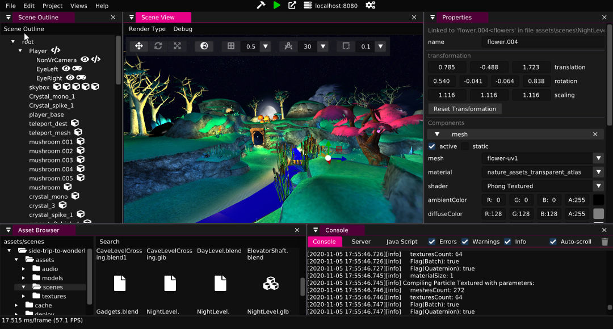

[Wonderland Engine](https://wonderlandengine.com/) is a highly performant WebXR focused development platform.

The Wonderland Editor (Windows, MacOS, Linux) makes WebXR development accessible and provides a very efficient workflow,
e.g. by reloading the browser for you whenever your files change.

WebAssembly and optimizations like automatically batching your scene allow you to draw many objects without having to worry
about performance.

Start with the [Quick Start Guide](https://wonderlandengine.com/getting-started/quick-start/) and find a [list of examples](https://wonderlandengine.com/showcase)
to help you get started.
To start writing custom code, check out the [JavaScript Getting Started Guide](https://wonderlandengine.com/getting-started/quick-start-js/)
and refer to the [JavaScript API Documentation](https://wonderlandengine.com/jsapi/).

